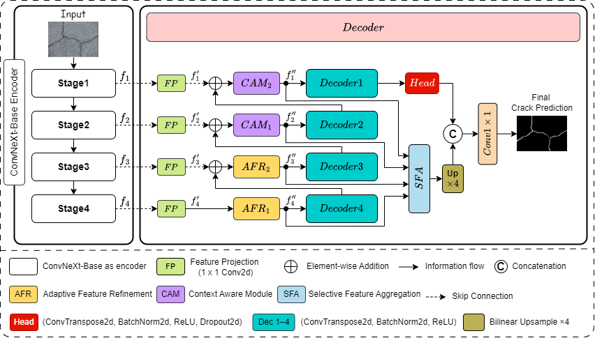

<div align="center">
<h1>CrackRefineNet</h1>
<h3>CrackRefineNet: A Context- and Refinement-Driven Architecture for Robust Crack Segmentation under Real-World and Zero-Shot Conditions</h3>
</div>

This repository provides the official implementation of **CrackRefineNet**, a context- and refinement-driven convolutional architecture for **robust crack segmentation** under various conditions.  
CrackRefineNet is implemented using **[MMSegmentation v1.1.1](https://github.com/open-mmlab/mmsegmentation/tree/v1.1.1)** as the core framework.

## Network Architecture

<p align="center">
  
</p>

## Installation
We use **[MMSegmentation v1.1.1](https://github.com/open-mmlab/mmsegmentation/tree/v1.1.1)** as the codebase.

For install and data preparation, please find the guidelines in **[MMSegmentation v1.1.1](https://github.com/open-mmlab/mmsegmentation/tree/v1.1.1)** for the installation and data preparation.


## Datasets
You can download the **preprocessed datasets** used in our experiments from the table below.  
Once downloaded, place each dataset inside the **`/data`** folder located in the root directory of this repository.  
If the folder does not exist, simply create it using:

```bash
mkdir data
```
| Dataset  | Download Link                                                         |
| -------- | --------------------------------------------------------------------- |
| RCFD     | [Google Drive](https://drive.google.com/drive/folders/153GLBwBFaxcGSxkijpqYH_umJuubvXmU?usp=sharing) |
| CFD      | [Google Drive](https://drive.google.com/drive/folders/1PmIvV4FhBN7iNNnu6pOypW51VOB0A8PH?usp=sharing) |
| Crack500 | [Google Drive](https://drive.google.com/drive/folders/1NGXwtNuItcpx15cyvMnz7aBm-OcM94wz?usp=sharing) |
| Sylvie   | [Google Drive](https://drive.google.com/drive/folders/1jQhGLdPR04aQHznINPUF53p4UEfcW_he?usp=sharing) |


## Pretrained Weights
| Dataset  | Checkpoint File               | Download Link                                                         |
| -------- | ----------------------------- | --------------------------------------------------------------------- |
| RCFD     | `crackrefinenet_rcfd.pth`     | [Google Drive](https://drive.google.com/file/d/1p2KSbGwrH6LdBhFh92eUEbPgshkP-CXt/view?usp=sharing) |
| CFD      | `crackrefinenet_cfd.pth`      | [Google Drive](https://drive.google.com/file/d/1gjXX9tE6y2I8udP8SKZmjd419NXPx9IK/view?usp=sharing) |
| Crack500 | `crackrefinenet_crack500.pth` | [Google Drive](https://drive.google.com/file/d/1hhGWZ-6jt9Drpjacs01ZAK9SqJyT3wFF/view?usp=sharing) |
| Sylvie   | `Same file of CFD (Zero-Shot)`            | [Google Drive](https://drive.google.com/file/d/1gjXX9tE6y2I8udP8SKZmjd419NXPx9IK/view?usp=sharing) |


## Training and Evaluation

**Training**
Before training, change variables such as dataset path, batch size, etc in configs/crack_new_whole_(RCFD, CFD, or crack500). 
```
cd CrackRefineNet
python ./tools/train.py ./configs/crack_new_whole_(RCFD, CFD, or crack500)/convnext_crackrefineNet.py 
```

**Testing**
Before testing, choose config file path configs/crack_new_whole_(RCFD, CFD, or crack500) and its checkpoint. 
```
cd CrackRefineNet
python ./tools/test.py ./configs/crack_new_whole_(RCFD, CFD, or crack500)/convnext_crackrefineNet.py ./checkpoints/crackrefinenet_(RCFD, CFD, or Crack500).pth 
```

## Acknowledgements

This project is built upon **[MMSegmentation v1.1.1](https://github.com/open-mmlab/mmsegmentation/tree/v1.1.1)**. We thank the open-source community for enabling high-quality research and development in semantic segmentation.